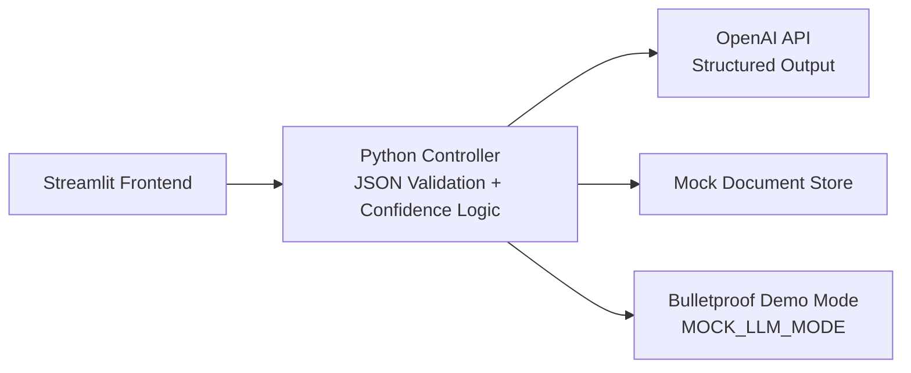

# AI Trust Layer

### Helping non-technical users understand, trust, and act on AI-generated answers

> A trust interface layer for enterprise RAG systems — designed for non-technical users who need to understand, trust, and act on AI-generated information.


---

## 🚀 Run & Deploy

Run the prototype locally in seconds — it ships in offline demo mode, so **no API key is needed**:

```bash
cd ai_trust_layer
pip install -r requirements.txt
streamlit run app.py        # opens http://localhost:8501
```

Prefer a live URL? Deploy it free to Streamlit Community Cloud in a few clicks — full steps in [DEPLOY.md](DEPLOY.md). A GitHub icon in the top-right of the app links back to the source repository.

---

## 🎯 The Problem

Enterprise RAG (Retrieval-Augmented Generation) systems give confident-sounding answers. But for the people who actually act on them — rail-transit low voltage system integrators, operations managers — **there is no signal telling them *when* to trust the answer and *when* to double-check.**


---

## 💡 The Solution

### Key Features

| Feature | What It Does | Why It Matters |
|---------|-------------|----------------|
| 📊 Confidence Indicator | Three-tier labels (High / Medium / Low) recognised at a glance | Users read colour, not scores, to know whether to trust |
| 🚨 Low-Confidence Alert | Low confidence triggers a plain-language alert plus action links | Not a cold score — it tells the user *what to do* |
| 📄 Source Transparency | Every answer cites its source document and page | Trust requires traceability |
| 📖 Jargon Translation | Technical terms auto-translated into plain language | Closes the cognitive translation gap |
| 📈 Admin Dashboard | Monitors trust health, low-confidence rate, and high-frequency terms | Upgrades one-way display into a human–AI feedback loop |


---

## 🏗️ Architecture



```
Streamlit Frontend
    ↕
Python Controller (JSON Validation + Confidence Logic)
    ↕
OpenAI API (Structured Output) + Mock Document Store
    ↕
Bulletproof Demo Mode (MOCK_LLM_MODE toggle)
```

**Design Principles:**
1. Progressive Disclosure — Minimal by default; expand on demand
2. Trust Calibration — Three tiers, differentiated — never deciding for the user
3. Structured Data Contract — JSON-Schema driven — no NLP guessing
4. Human–AI Loop — Front-end trust surface + back-end Admin = an iterative system

---

## 🎬 What you'll see


Explore three confidence scenarios via the example chips: high-confidence answers with visible sources, a low-confidence alert telling you what to verify, and progressive disclosure of technical detail on demand. The **Admin** button opens the trust-health monitoring dashboard.

---

## ☁️ Deploy to the Cloud

This repository is a self-contained, interactive portfolio prototype on Streamlit Community Cloud (free). It runs the real AI Trust Layer demo offline (no API key needed) and links back to the full design documentation on GitHub. Full instructions are in [DEPLOY.md](DEPLOY.md) — in short: push to GitHub, connect the repo at streamlit.io/cloud with entry `ai_trust_layer/app.py`, Python 3.12, and no secrets required (`MOCK_LLM_MODE` defaults to `true`).

---

## 🛠️ Tech Stack

| Layer | Technology | Why |
|-------|-----------|-----|
| Frontend | Streamlit | Pure Python, no HTML/CSS/JS needed |
| LLM | OpenAI API (gpt-4o-mini) | Structured output (JSON mode) |
| Validation | Pydantic v2 | Type-safe data contract enforcement |
| Config | python-dotenv | Environment variable management |

---

## 📄 License

MIT — This is a portfolio project for academic application purposes.
