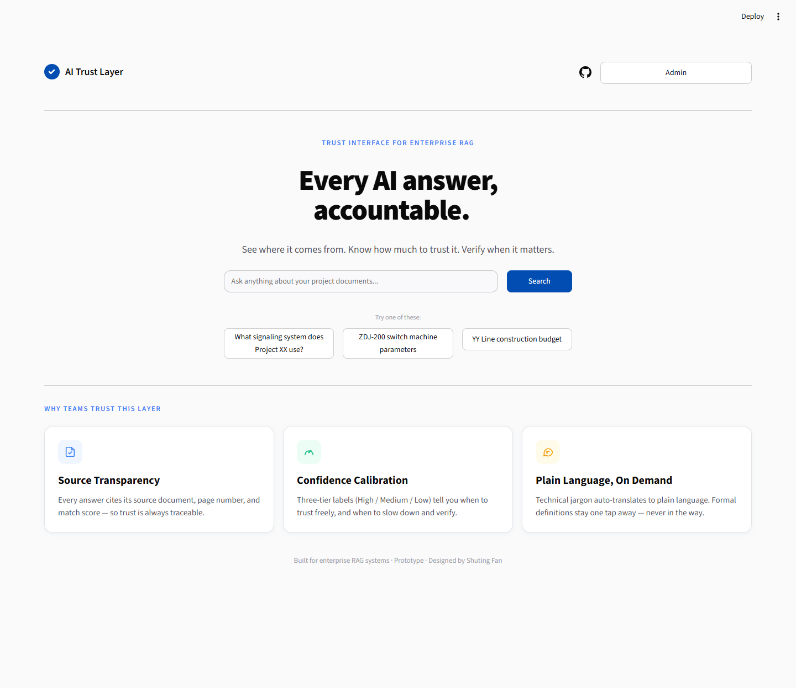
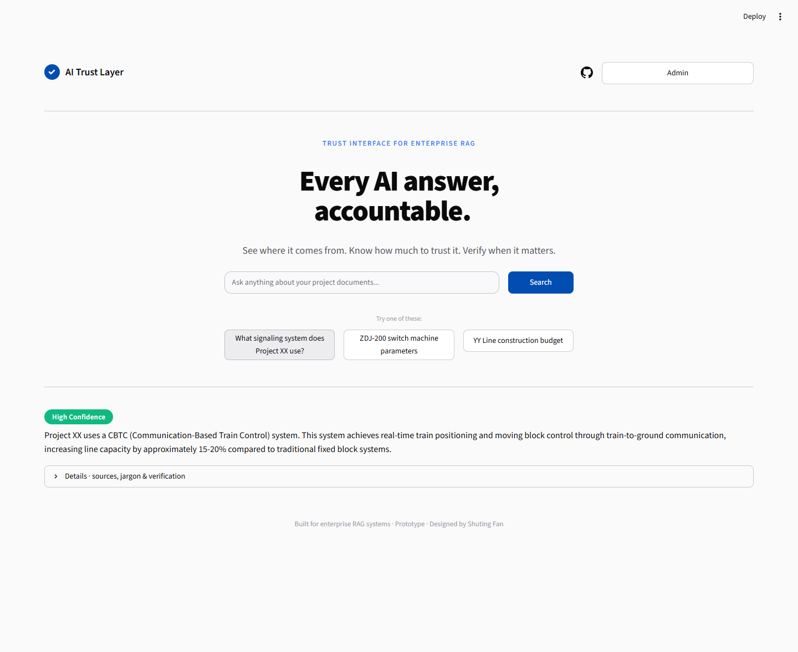
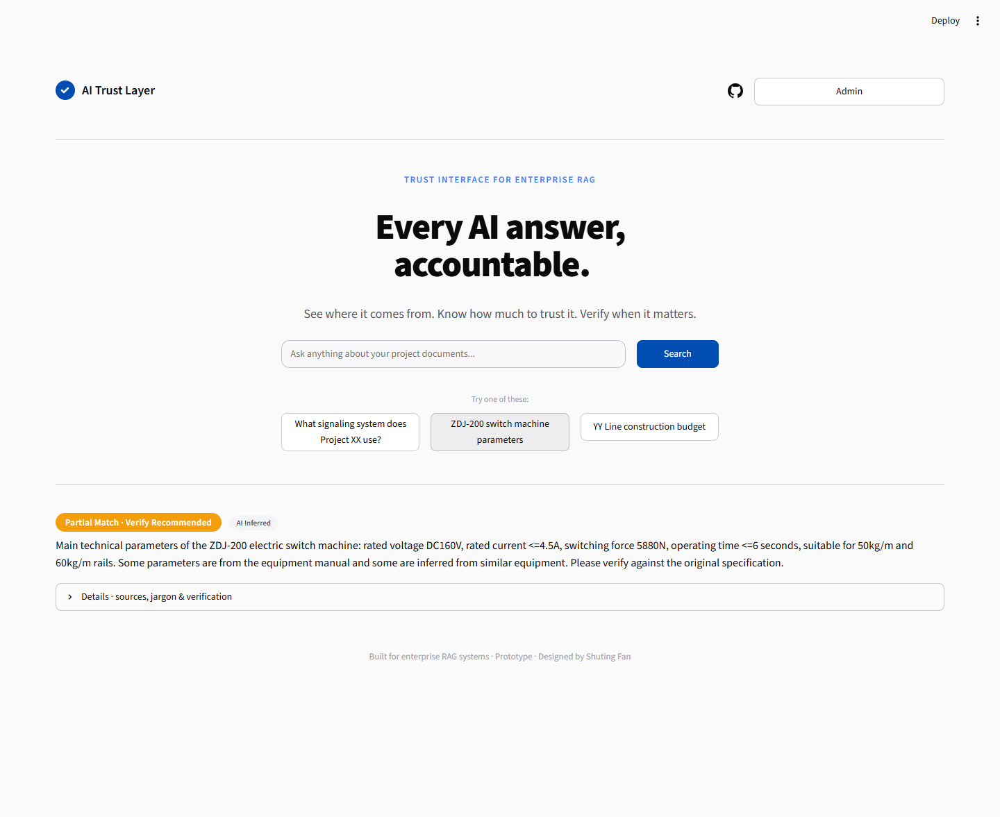
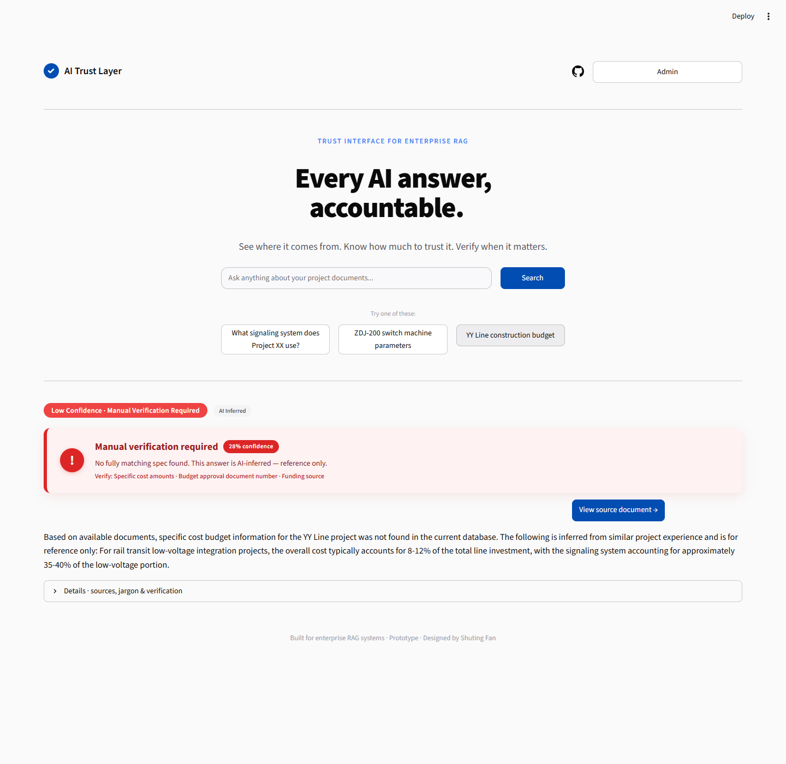
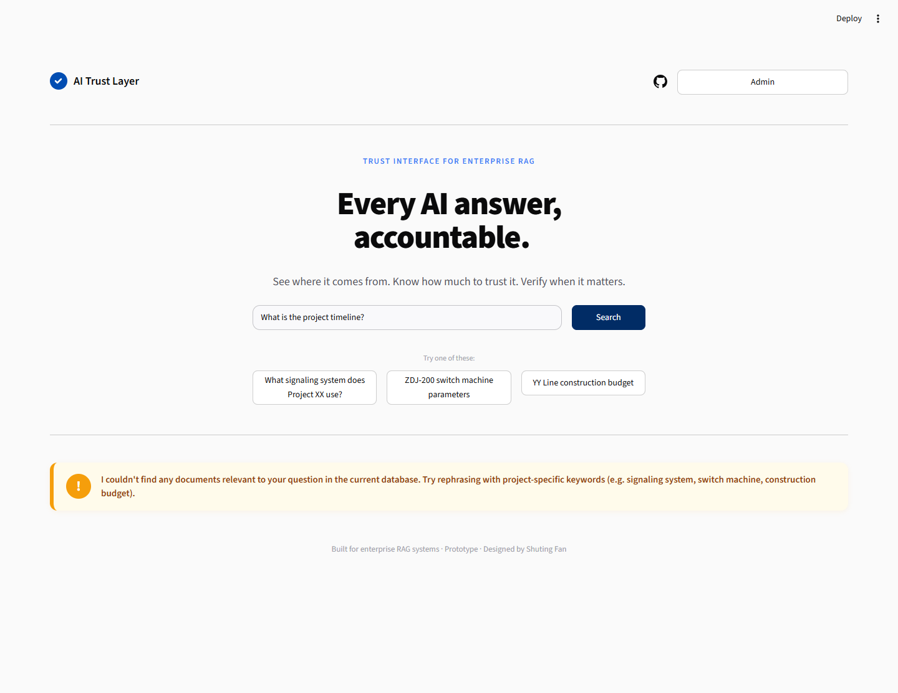
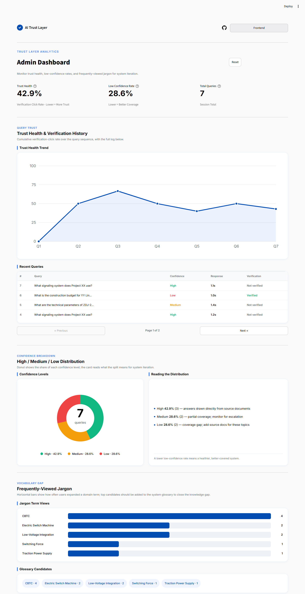
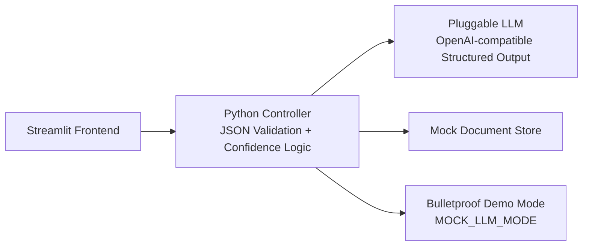

# AI Trust Layer

### Helping non-technical users understand, trust, and act on AI-generated answers

> A trust interface layer for enterprise RAG systems — designed for non-technical users who need to understand, trust, and act on AI-generated information.



---

## 🚀 Run & Deploy

Run the prototype locally in seconds — it ships in offline demo mode, so **no API key is needed**:

```bash
cd ai_trust_layer
pip install -r requirements.txt
streamlit run app.py        # opens http://localhost:8501
```

Prefer a live URL? Deploy it free to Streamlit Community Cloud in a few clicks — full steps in [DEPLOY.md](DEPLOY.md). A GitHub icon in the top-right of the app links back to the source repository.

---

## 🎯 The Problem

Enterprise RAG (Retrieval-Augmented Generation) systems give confident-sounding answers. But for the people who actually act on them — rail-transit low voltage system integrators, operations managers — **there is no signal telling them *when* to trust the answer and *when* to double-check.**

---

## 💡 The Solution

### Key Features

| Feature | What It Does | Why It Matters |
|---------|-------------|----------------|
| 📊 Confidence Indicator | Three-tier labels (High / Medium / Low) recognised at a glance | Users read colour, not scores, to know whether to trust |
| 🚨 Low-Confidence Alert | Low confidence triggers a plain-language alert plus action links | Not a cold score — it tells the user *what to do* |
| 📄 Source Transparency | Every answer cites its source document and page | Trust requires traceability |
| 📖 Jargon Translation | Technical terms auto-translated into plain language | Closes the cognitive translation gap |
| 📈 Admin Dashboard | Monitors trust health, low-confidence rate, and high-frequency terms | Upgrades one-way display into a human–AI feedback loop |

---

## 🖥️ Frontend — For the Non-Technical End User (Li Ming)

> The prototype is built for two personas. The frontend below is what a non-technical end user (Li Ming) sees; the Admin Dashboard is what the monitoring user (Wang Fang) uses. Together they are the complete AI Trust Layer product — exactly what a reviewer of this portfolio sees.

This is the interface a non-technical end user interacts with: type a question, get a confidence-calibrated answer. Details are collapsed by default — expand on demand.

### High confidence



### Medium confidence



### Low confidence



### No relevant documents



### Try these demo queries

| Query | Triggers | What to look for |
|-------|----------|------------------|
| "What signaling system does Project XX use?" | High confidence | Green label, collapsed details, clean sources |
| "ZDJ-200 switch machine parameters" | Medium confidence | Yellow label, AI-inferred, collapsed sources & jargon |
| "YY Line construction budget" | Low confidence | Red alert banner, action link, inferred answer |
| "What is the project timeline?" | No match | Amber banner with rephrasing guidance |

---

## 📊 Admin Dashboard — For the Monitoring User (Wang Fang)

The monitoring side: aggregated trust health, confidence distribution, and frequently-viewed jargon — so the translator/admin can see where the system is under-served and which terms need clearer definitions.



---

## 🏗️ Architecture



```
Streamlit Frontend
    ↕
Python Controller (JSON Validation + Confidence Logic)
    ↕
Pluggable LLM (OpenAI-compatible Structured Output) + Mock Document Store
    ↕
Bulletproof Demo Mode (MOCK_LLM_MODE toggle)
```

---

## 🧭 Design Principles

1. **Progressive Disclosure** — Minimal by default; expand on demand
2. **Trust Calibration** — Three tiers, differentiated — never deciding for the user
3. **Structured Data Contract** — JSON-Schema driven — no NLP guessing
4. **Human–AI Loop** — Front-end trust surface + back-end Admin = an iterative system

---

## ☁️ Deploy to the Cloud

This repository is a self-contained, interactive portfolio prototype on Streamlit Community Cloud (free). It runs the real AI Trust Layer demo offline (no API key needed) and links back to the full design documentation on GitHub. Full instructions are in [DEPLOY.md](DEPLOY.md) — in short: push to GitHub, connect the repo at streamlit.io/cloud with entry `ai_trust_layer/app.py`, Python 3.12, and no secrets required (`MOCK_LLM_MODE` defaults to `true`).

---

## 🛠️ Tech Stack

| Layer | Technology | Why |
|-------|-----------|-----|
| Frontend | Streamlit | Pure Python, no HTML/CSS/JS needed |
| LLM | Pluggable LLM (mock by default; OpenAI-compatible Structured Output) | Runs offline with `MOCK_LLM_MODE`; swap in any OpenAI-compatible model for live use |
| Validation | Pydantic v2 | Type-safe data contract enforcement |
| Config | python-dotenv | Environment variable management |

---

## 📁 Project Structure

```
ai_trust_layer/
├── app.py              # Entry point, routing, session state
├── config.py           # Global config, MOCK_LLM_MODE switch
├── models.py           # Pydantic data contract (TrustLayerResponse)
├── mock_docs.py        # Mock document store + simulated RAG retrieval
├── llm_api.py          # LLM API calls + mock mode dispatcher
├── frontend.py         # Frontend view: F1–F4 rendering
├── admin.py            # Admin view: trust-health dashboard
├── interaction_log.py  # Interaction logging + metrics calculation
├── mock_documents/     # Simulated project knowledge base
├── screenshots/        # Curated demo screenshots
├── requirements.txt    # Dependencies
└── .env.example        # Configuration template
```

---

## 🎓 Academic Context

This prototype is a student design project exploring the HCI core topics of **Explainable AI (XAI)** and **Trust Calibration** in enterprise RAG systems — submitted as part of an MSc in Interaction and Experience Design application.

---

## 📄 License

MIT — This is a portfolio project for academic application purposes.
