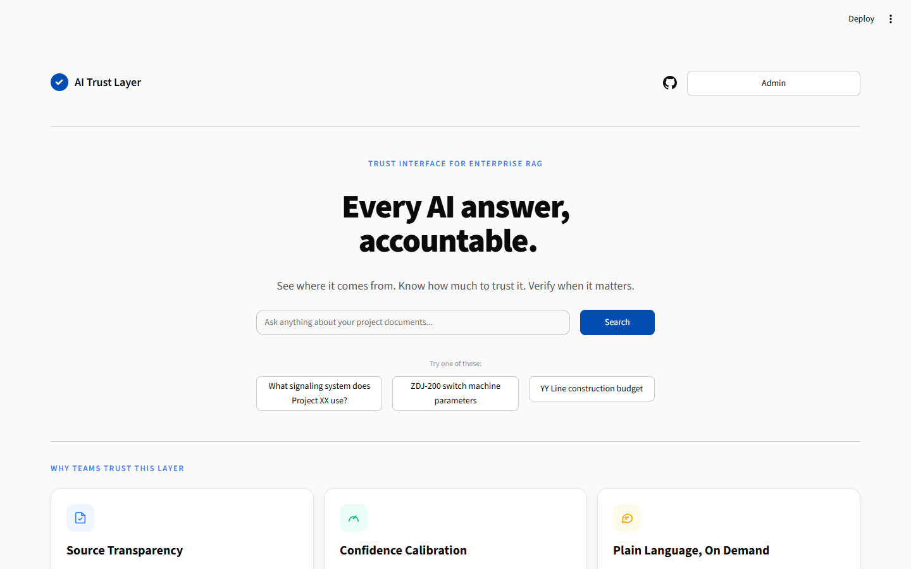
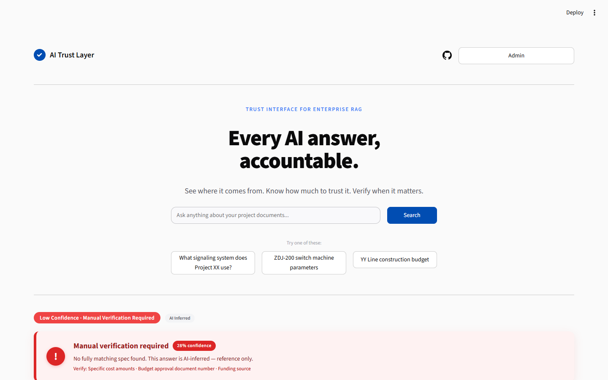
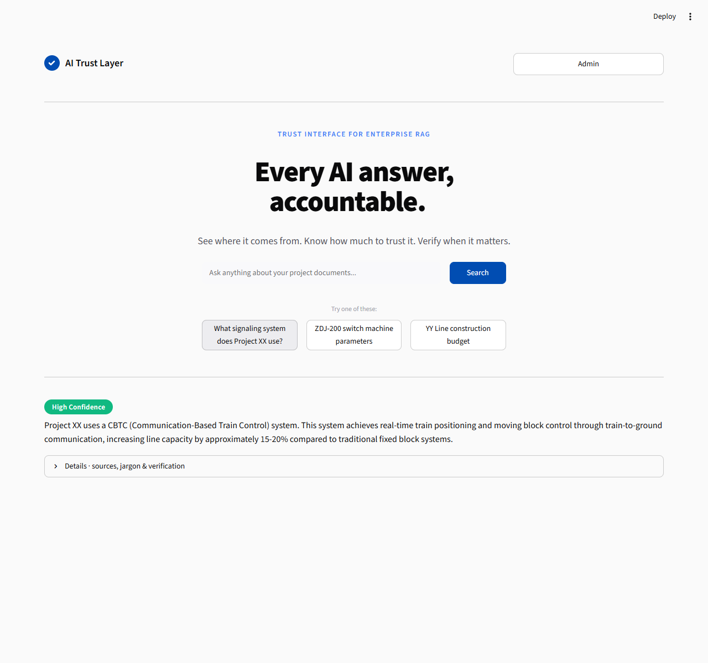
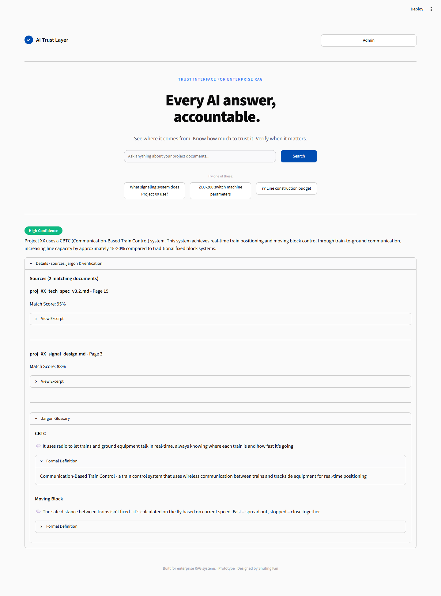
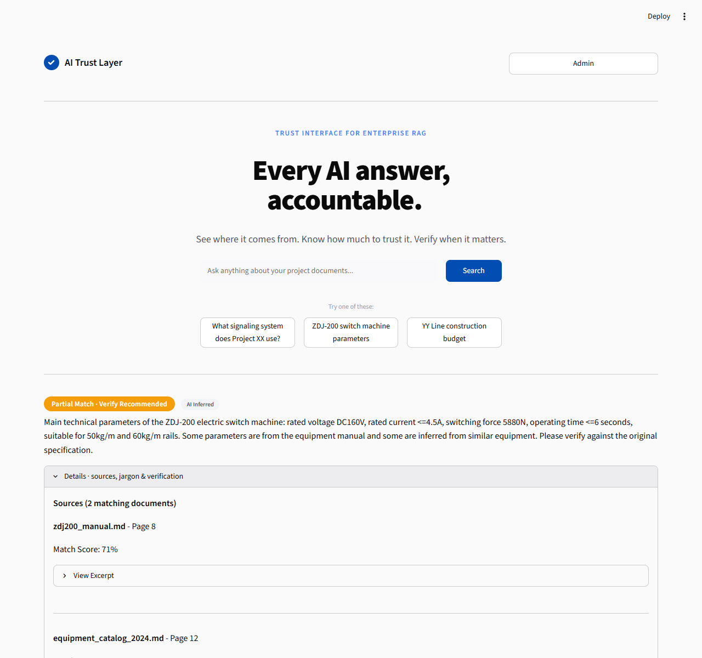
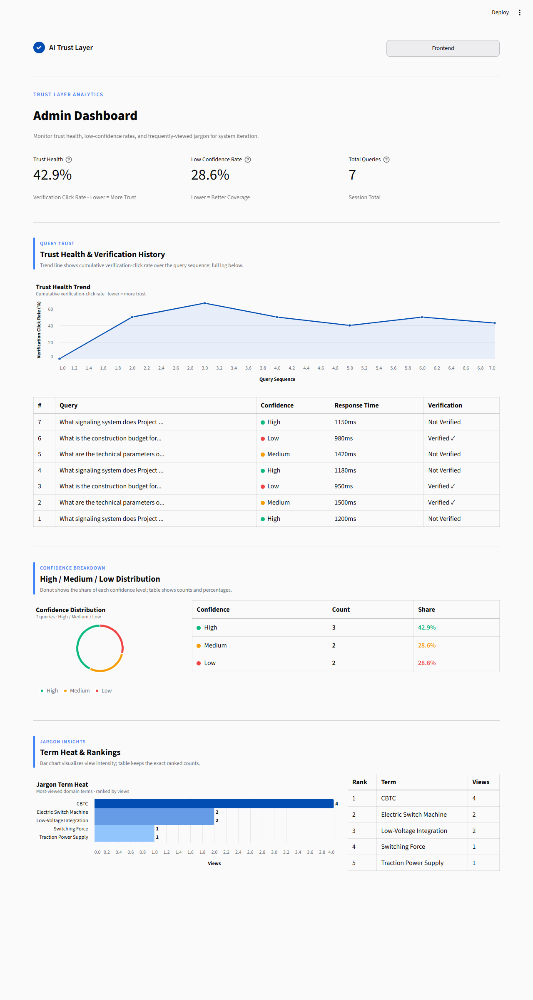

# AI Trust Layer

> **A trust interface for enterprise RAG systems** — helping non-technical users *see where an AI answer comes from, know how much to trust it, and verify when it matters.*
>
> Interactive & Experience Design portfolio piece · Shuting Fan · MSc Interaction & Experience Design

---

## Why this exists

Enterprise RAG (Retrieval-Augmented Generation) systems give confident-sounding answers. But for the people who actually act on them — rail-transit low voltage system integrators, operations managers — **there is no signal telling them *when* to trust the answer and *when* to double-check.**

AI Trust Layer is a **trust interface layer** that sits on top of a RAG answer and makes its reliability *legible*:

- a **three-tier confidence label** (High / Medium / Low) on every answer,
- **progressive disclosure** — sources, jargon, and verification steps stay collapsed until the user asks,
- a **low-confidence alert banner** that demands manual verification before action,
- a **no-document fallback** that is honest when the knowledge base has no match,
- and an **Admin Dashboard** that lets operations see trust health, confidence distribution, and the vocabulary gap across real usage.

It is built to run with **zero API keys** (a bulletproof demo mode), so a reviewer can open it and see the full experience immediately.

---

## Key features

| # | Feature | What it does |
|---|---|---|
| 1 | **Three-tier confidence labels** | Every answer is tagged High (green) / Medium (orange) / Low (red) — the semantic triplet echoes through the whole UI. |
| 2 | **Progressive disclosure** | Sources, jargon glossary, and verification fields are collapsed by default; the user clicks to expand, controlling their own cognitive load. |
| 3 | **Low-confidence alert banner** | When confidence is Low, a high-visual-weight banner (accent bar + icon + soft shadow) says *"Manual verification required"* and lists exactly what to check. |
| 4 | **No-document fallback** | If the query matches no source, an amber banner says so honestly — no false confidence. |
| 5 | **Admin Dashboard** | Trust Health trend, Confidence Distribution donut, Jargon Term Heat, and a paginated Recent Queries log — paired with interpretation cards, not raw number dumps. |
| 6 | **Bulletproof demo mode** | `MOCK_LLM_MODE` serves three schema-valid canned answers; with no API key the app forces demo mode automatically. |
| 7 | **Bilingual controls** | UI copy is English (application is for an Irish university); a few admin controls carry CN secondary labels for the local context. |

---

## Demo

### Screenshots

**Home — onboarding / value proposition**


**Low-confidence alert banner**


**High confidence — collapsed**


**High confidence — expanded (sources / jargon / verification)**


**Medium confidence — expanded**


**Low confidence result**


**Admin Dashboard (full)**


### Walkthrough video

- 3-minute demo: [`ai_trust_layer/videos/ai_trust_layer_demo_3min.mp4`](ai_trust_layer/videos/ai_trust_layer_demo_3min.mp4) · ([`.webm`](ai_trust_layer/videos/ai_trust_layer_demo_3min.webm))
- Short demo: [`ai_trust_layer/videos/ai_trust_layer_demo.mp4`](ai_trust_layer/videos/ai_trust_layer_demo.mp4)

---

## Architecture

The prototype is a single Streamlit app composed of focused modules:

| Module | Responsibility |
|---|---|
| `app.py` | App shell, navigation (Frontend ⇄ Admin), session seeding, page config + webfont injection |
| `frontend.py` | Home onboarding, answer rendering, confidence label, low-confidence alert, progressive disclosure, no-doc banner |
| `admin.py` | Admin Dashboard — metric cards, inline-SVG charts (trend / donut / bar), Recent Queries table + pagination, footer |
| `interaction_log.py` | Interaction-log model + `calculate_admin_metrics()` (the analytics engine) |
| `llm_api.py` | `MOCK_LLM_MODE` handling, `get_mock_response()`, the three canned answers + `nomatch` |
| `models.py` | Pydantic response schema + `create_fallback_response()` |
| `config.py` | Config + the "no API key ⇒ demo mode" safety rule |
| `mock_documents/` | Domain corpus (rail-transit low voltage specs) used by the demo answers |
| `run.bat` | One-click Windows launcher (kill stale Streamlit → activate venv → serve on 8600) |

**Data flow**: user query → `llm_api` (mock or real) → `models` validates → `frontend` renders with confidence + progressive disclosure → interactions logged → `admin` aggregates via `interaction_log`.

---

## Design process (P0 → P1)

The visual layer was designed in **ardot** (mockup file `707535023504113`) and implemented as custom HTML/CSS inside Streamlit, then verified against the *real rendered DOM*.

- **Design system**: `soft-card-pastel-finance` — warm-white `#FAFAFA` background, white cards, deep-blue `#014DB2` brand trust colour, Inter + IBM Plex Mono typography, 24px card / 50px pill radii, blue-tinted shadows.
- **P0 — frontend trust surface**: home onboarding layer, low-confidence alert banner (accent bar + icon + shadow for ~5× visual weight), confidence pills, click-to-expand progressive disclosure.
- **P1 — Admin Dashboard**: visual analytics (trend / donut / bar) paired one-to-one with raw data; redundancy removed in favour of PRD-driven interpretation cards; internal requirement IDs kept out of the UI; everything aligned pixel-by-pixel to the ardot mockup.
- **Constraint discipline**: ≤3 colours per scene, consistent alignment, no Chinese in visuals (language consistency for the Irish application), unified number font across the whole app.

See [`08_Design_Implementation_Notes_EN.md`](08_Design_Implementation_Notes_EN.md) for the full design-implementation log, and [`09_Development_Changelog.md`](09_Development_Changelog.md) for the bug-fix / debugging trail.

---

## HCI theory alignment

The design is explicitly anchored toInteraction & Experience Design theory:

- **Progressive Disclosure** (Nielsen's heuristics) — hide complexity until requested.
- **Trust Calibration** (Lee & See, 2004) — show calibrated confidence so users neither over- nor under-trust.
- **Cognitive Load Theory** (Sweller) — collapse sources/jargon by default to protect working memory.
- **Explainable AI (XAI)** — surface *where* the answer comes from and *what* to verify.
- **Human-in-the-Loop** — the low-confidence banner makes the human the explicit verification gate before action.

---

## Tech stack

- **Python 3.12** · **Streamlit 1.60**
- **Pydantic** (response schema) · **python-dotenv** (config)
- Custom **HTML/CSS + inline SVG** for the trust surface and charts (no charting dependency at runtime)
- **ardot** for high-fidelity mockups

---

## Quick start

```bash
# 1. Create & activate the virtual environment
cd ai_trust_layer
python -m venv .venv
.venv\Scripts\activate          # Windows CMD: call .venv\Scripts\activate.bat
#   (Git Bash: source .venv/Scripts/activate)

# 2. Install dependencies
pip install -r requirements.txt

# 3. Run — demo mode works with NO API key
streamlit run app.py --server.port 8600
#   or just double-click run.bat
```

Open <http://localhost:8600>. With no `OPENAI_API_KEY` set, the app automatically enters **bulletproof demo mode** and serves the three showcase scenarios (signaling system / construction budget / switch machine).

> To demonstrate the **empty state**: open Admin, click **"Clear demo data"**, then switch to Admin again — the dashboard shows the *"No data yet — please query the frontend first"* state. **"Restore demo data"** brings the demo back.

---

## Documentation (PRD chain)

The product was specified through a six-step PRD chain, provided here in **English** (the default submission language):

| # | Document (PRD step) | File |
|---|---|---|
| 1 | Problem definition | `01_PRD_Step1_Problem_Definition_EN.md` |
| 2 | User personas | `02_PRD_Step2_User_Personas_EN.md` |
| 3 | Product vision | `03_PRD_Step3_Product_Vision_EN.md` |
| 4 | Functional specs | `04_PRD_Step4_Functional_Specs_EN.md` |
| 5 | Technical architecture | `05_PRD_Step5_Technical_Architecture_EN.md` |
| 6 | Portfolio scope | `06_PRD_Step6_Portfolio_Scope_EN.md` |

The design-implementation notes (`08_Design_Implementation_Notes_EN.md`) and the development changelog (`09_Development_Changelog.md`) are referenced in the *Design process* section above.

---

## Author

**Shuting Fan** — MSc Interaction & Experience Design portfolio.
Built for enterprise RAG systems in the rail-transit low voltage integration domain.
