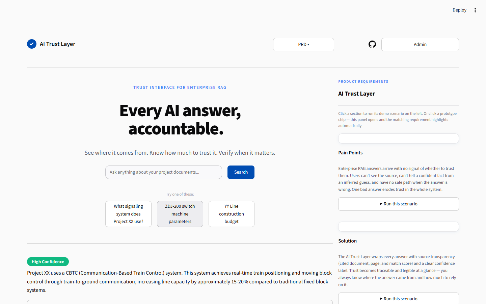
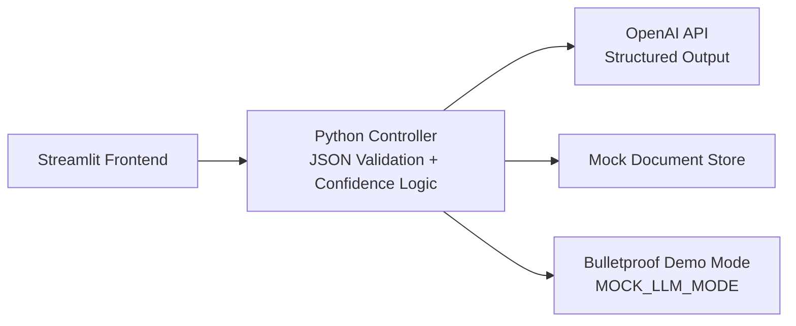

# AI Trust Layer

### Helping non-technical users understand, trust, and act on AI-generated answers

> A trust interface layer for enterprise RAG systems — designed for non-technical users who need to understand, trust, and act on AI-generated information.

## 🧩 Tech Stack


---

## 🚀 Live Demo

Try the interactive prototype: **[ai-trust-layer-prototype.streamlit.app](https://ai-trust-layer-prototype.streamlit.app)**

The left side runs the real AI Trust Layer Streamlit prototype; the right side opens an interactive PRD panel. Click any prototype chip to open and highlight the matching requirement, or click a PRD section to run its demo scenario. A GitHub icon in the top-right links back to the source repository.



---

## 🎯 The Problem

Enterprise RAG (Retrieval-Augmented Generation) systems give confident-sounding answers. But for the people who actually act on them — rail-transit low voltage system integrators, operations managers — **there is no signal telling them *when* to trust the answer and *when* to double-check.**


---

## 💡 The Solution

### Key Features

| Feature | What It Does | Why It Matters |
|---------|-------------|----------------|
| 📊 Confidence Indicator | Three-tier labels (High / Medium / Low) recognised at a glance | Users read colour, not scores, to know whether to trust |
| 🚨 Low-Confidence Alert | Low confidence triggers a plain-language alert plus action links | Not a cold score — it tells the user *what to do* |
| 📄 Source Transparency | Every answer cites its source document and page | Trust requires traceability |
| 📖 Jargon Translation | Technical terms auto-translated into plain language | Closes the cognitive translation gap |
| 📈 Admin Dashboard | Monitors trust health, low-confidence rate, and high-frequency terms | Upgrades one-way display into a human–AI feedback loop |


---

## 🏗️ Architecture



```
Streamlit Frontend
    ↕
Python Controller (JSON Validation + Confidence Logic)
    ↕
OpenAI API (Structured Output) + Mock Document Store
    ↕
Bulletproof Demo Mode (MOCK_LLM_MODE toggle)
```

**Design Principles:**
1. Progressive Disclosure — Minimal by default; expand on demand
2. Trust Calibration — Three tiers, differentiated — never deciding for the user
3. Structured Data Contract — JSON-Schema driven — no NLP guessing
4. Human–AI Loop — Front-end trust surface + back-end Admin = an iterative system

---

## 🎬 Demo


**3-minute demo video** — real walkthrough with English subtitles (recorded by driving the live Streamlit app):

<video src="ai_trust_layer/videos/ai_trust_layer_demo.mp4" controls width="100%" poster="ai_trust_layer/screenshots/p0_high_expanded.png"></video>

**Try it yourself:**
```bash
pip install -r requirements.txt
cp .env.example .env  # Set MOCK_LLM_MODE=true for offline demo
streamlit run app.py
```

---

## 🛠️ Tech Stack

| Layer | Technology | Why |
|-------|-----------|-----|
| Frontend | Streamlit | Pure Python, no HTML/CSS/JS needed |
| LLM | OpenAI API (gpt-4o-mini) | Structured output (JSON mode) |
| Validation | Pydantic v2 | Type-safe data contract enforcement |
| Config | python-dotenv | Environment variable management |

---

## 📄 License

MIT — This is a portfolio project for academic application purposes.
